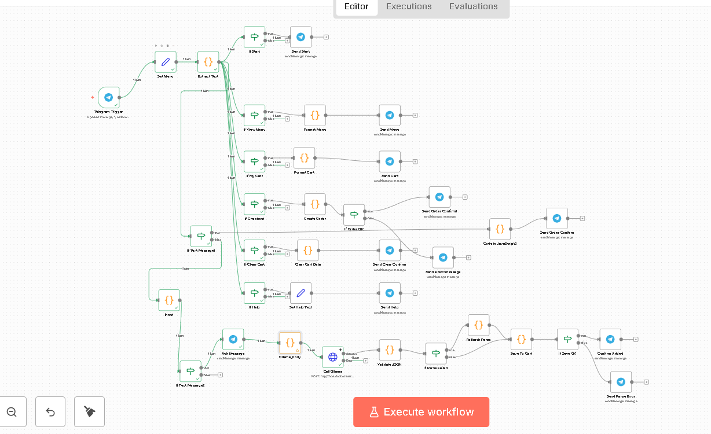

# 🤖 Restaurant Telegram Bot with N8N & Ollama

A fully automated restaurant chatbot for Telegram that uses **N8N** for workflow automation and **Ollama** (running locally) for AI-powered natural language responses.

---


## ✨ Features

- 🤖 Intelligent conversational AI using Ollama
- 🍕 Display restaurant menu
- 📦 Process customer orders
- 💬 Automated customer support responses
- 🌐 Local AI processing (no external API costs)
---
## Workflow


---
## 📦 Prerequisites

Before you begin, ensure you have the following installed:

- Docker & Docker Compose installed
- Ollama installed and running locally
- Telegram Bot Token from [@BotFather](https://t.me/botfather)
- ngrok account (for local development)

---

## 🚀 Installation

### Step 1: Clone the Repository

```bash
git clone https://github.com/yourusername/restaurant-telegram-bot.git
cd restaurant-telegram-bot
```

### Step 2: Install & Configure Ollama

#### Install Ollama
Visit [https://ollama.ai](https://ollama.ai) and download for your OS.

#### Pull the AI Model
```bash
# Download any model like for example (llama3.1:8b), I used this model because it's already installed on my device
ollama pull phi3.5:3.8b-mini-instruct-q4_K_M

# Verify installation
ollama list

# Start Ollama server (if not auto-started)
ollama serve
```

#### Test Ollama
```bash
# Check if Ollama is running
curl http://localhost:11434/api/tags
```


### Step 3: Create Telegram Bot

1. Open Telegram and search for `@BotFather`
2. Send `/newbot` command
3. Follow the prompts to create your bot
4. Copy the **API token** (looks like: `1234567890:ABCdefGHIjklMNOpqrsTUVwxyz`)

### Step 4: Setup Ngrok

```bash
# Sign up at https://ngrok.com and get your auth token
ngrok config add-authtoken YOUR_AUTH_TOKEN

# Start ngrok tunnel on port 80
ngrok http 80
```

Copy the **Forwarding URL** (e.g., `https://xxxxx.ngrok-free.dev`)

---

## ⚙️ Configuration

### Step 1: Environment Variables

```bash
# Copy the example environment file
cp .env.example .env

# Edit with your values
notepad .env  # Windows
nano .env     # Mac/Linux
```

### Step 2: Fill in `.env`

```bash
# N8N & Webhook Configuration
WEBHOOK_URL=https://your-actual-ngrok-url.ngrok-free.dev

# Timezone
TIMEZONE=Africa/Cairo

# Telegram Bot Token from BotFather
TELEGRAM_BOT_TOKEN=1234567890:ABCdefGHIjklMNOpqrsTUVwxyz

# Ollama Configuration 
OLLAMA_HOST=http://host.docker.internal:11434
OLLAMA_MODEL=phi3.5:3.8b-mini-instruct-q4_K_M
```

⚠️ **Important**: Update `WEBHOOK_URL` every time you restart ngrok!

---

## 🎯 Usage

### Start All Services

```bash
# 1. Ensure Ollama is running
curl http://localhost:11434/api/tags

# 2. Start ngrok (in a separate terminal)
ngrok http 80

# 3. Update .env with the new ngrok URL
# Edit WEBHOOK_URL in .env

# 4. Start N8N with Docker Compose
docker-compose up -d

# 5. Check if N8N is running
docker ps
```

Expected output:
```
CONTAINER ID   IMAGE              PORTS                    NAMES
302ad693a960   n8nio/n8n:latest   0.0.0.0:80->5678/tcp     n8n
```
### Setup Telegram Bot Credentials in n8n

1. Open n8n: `http://localhost`
2. Go to **Settings** → **Credentials**
3. Click **Add Credential**
4. Select **Telegram API**
5. Enter your Bot Token from @BotFather
6. Save with a memorable name (e.g., "restaurant_bot")

or 

1. upload the workflow ".json" **Import from File**
2. click on Telegram icons after upload the workflow 
3. from  **Credential to connect with** choose **Creat new Credential**
4. Enter your Bot Token from @BotFather in Access Token
5. Click **Save**


### Import Workflow

1. Open N8N: `http://localhost:80`
2. Go to **Workflows** → **Import from File**
3. Select `restaurant-bot-workflow.json`
4. Click **Save**
5. Click **Activate** (toggle should turn green)
Important note: if you change in the model you used for example you have (llama3.1:8b)
1- look for a code node called ollam_body in the workflow
2- double click on it 
3- in javascript code change in this line : 

```javaScript
 const ollamaRequestBody = {
  "model": "phi3.5:3.8b-mini-instruct-q4_K_M", #change the model name with your model name
  "format": "json",
  ......} 
  ```
**So it will be**
```javaScript
 const ollamaRequestBody = {
  "model": Your_model_name, 
  "format": "json",
  ......} 
  ```
### Test Your Bot

1. Open Telegram
2. Search for your bot by username
3. Send `/start`
4. view the menu and choose your order

---

## 📁 Project Structure

```
restaurant-telegram-bot/
├── docker-compose.yml              # Docker configuration for N8N
├── .env.example                    # Template for environment variables
├── .env                            # Your actual config (git-ignored)
├── .gitignore                      # Files to exclude from Git
├── README.md                       # This file
├── Telegram Food Bot.json    # N8N workflow export
└── menu.json                       # Restaurant menu data
```

### File Descriptions

| File | Purpose |
|------|---------|
| `docker-compose.yml` | Defines N8N container configuration |
| `.env.example` | Template with placeholder values |
| `.env` | Your actual secrets (never commit!) |
| `restaurant-bot-workflow.json` | Complete N8N automation logic |
| `menu.json` | Restaurant menu items and prices |
| `README.md` | Documentation (you're reading it!) |

---

## 🔧 Troubleshooting

### Issue: Bot doesn't respond

**Solution:**
```bash
# Check N8N logs
docker logs n8n -f

# Verify Ollama is running
curl http://localhost:11434/api/tags

# Check ngrok dashboard
# Open: http://127.0.0.1:4040
```

### Issue: "Failed to connect to Ollama"

**Cause:** N8N can't reach Ollama on host machine

**Solution:**
1. Verify Ollama is running:
   ```bash
   curl http://localhost:11434/api/tags
   ```

2. Check the workflow uses correct URL:
   ```
   ✅ http://host.docker.internal:11434/api/chat
   ❌ http://localhost:11434/api/chat
   ```

3. Restart N8N:
   ```bash
   docker-compose restart
   ```

### Issue: Webhook not receiving messages

**Cause:** Ngrok URL changed or workflow not activated

**Solution:**
1. Check if ngrok is running
2. Verify the ngrok URL matches `.env` file
3. Update `.env` if ngrok URL changed
4. Restart N8N: `docker-compose restart`
5. Ensure workflow is **Active** in N8N interface

### Issue: Ngrok URL keeps changing

**Cause:** Free ngrok accounts get random URLs on restart

**Solutions:**
- **Option 1**: Upgrade to ngrok paid plan for static URL
- **Option 2**: Update `.env` every time you restart ngrok:
  ```bash
  # After restarting ngrok, copy new URL
  notepad .env  # Update WEBHOOK_URL
  docker-compose restart  # Apply changes
  ```

---


## 📝 Notes

- **Telegram Token Security**: Tokens are stored securely in n8n's credential system, not in the workflow JSON
- **Data Persistence**: n8n data is stored in a Docker volume and persists between restarts
- **Ollama Models**: Ensure you have enough RAM for your chosen model (3.8B requires ~4GB)

## 🤝 Contributing

1. Fork the repository
2. Create a feature branch
3. Make your changes
4. Submit a pull request

